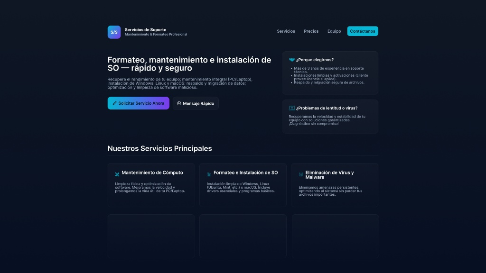
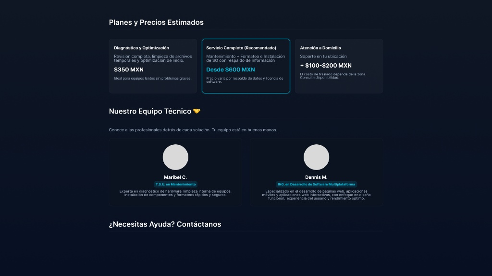
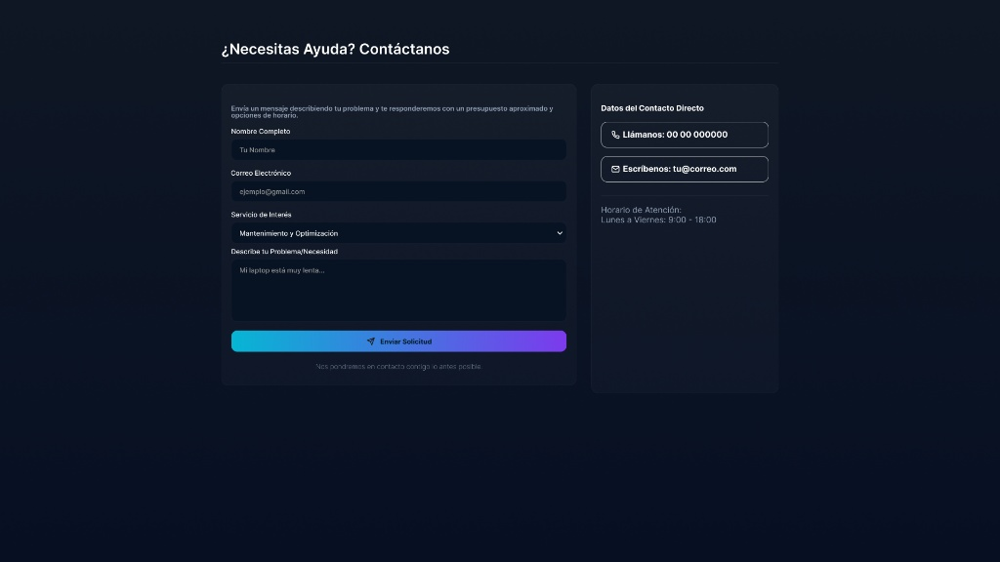

# 💻 Servicios de Soporte Técnico | Landing Page

**Mantenimiento, Formateo e Instalación de SO - Rápido y Seguro.**
Recupera el rendimiento de tu equipo con nuestros servicios integrales de soporte técnico.

## ✨ Características Principales

Esta _landing page_ está diseñada para ser la presencia web principal de un negocio de soporte técnico, destacando los servicios y facilitando la toma de contacto.

- **Página de Aterrizaje (Landing Page):** Diseño limpio, moderno y enfocado a la conversión de clientes.
- **Información de Servicios:** Detalles claros sobre Mantenimiento, Formateo e Instalación de SO, y Eliminación de Virus.
- **Sección de Precios:** Presentación estructurada de los planes de servicio con costos estimados.
- **Equipo Técnico:** Breve presentación de las profesionales detrás de la empresa.
- **Formulario de Contacto:** Permite a los usuarios solicitar un presupuesto vía **email** (`mailto:`) de forma directa.
- **Contacto Directo:** Enlaces rápidos a **WhatsApp** y teléfono.
- **Diseño Responsivo:** Visualización óptima en dispositivos móviles, tablets y escritorios.

---

## 🛠️ Tecnologías Utilizadas

El proyecto fue construido con un enfoque en la simplicidad y el rendimiento del lado del cliente.

| Tecnología             | Descripción                                                                  |
| :--------------------- | :--------------------------------------------------------------------------- |
| **HTML5**              | Estructura semántica de la página.                                           |
| **CSS3**               | Estilizado moderno, responsivo y con un tema oscuro (Dark Mode).             |
| **Vanilla JavaScript** | Lógica de envío de formulario por `mailto:` y manejo del enlace de WhatsApp. |
| **Font Awesome**       | Iconografía profesional para destacar servicios y puntos clave.              |

---

## ✨ Vista Previa del Diseño

La página presenta un diseño moderno en modo oscuro, centrado en la usabilidad y la conversión.

### 1. Secciones Principales (Hero y Servicios)

Muestra la propuesta de valor y los servicios destacados.



---

### 2. Precios y Equipo Técnico

Detalle de los planes de servicio y presentación de los especialistas.



---

### 3. Contacto y Formulario

Formulario de contacto para solicitar servicios y datos directos.



---

## 🚀 Despliegue y Uso

Dado que es una _landing page_ estática (solo HTML, CSS y JS del lado del cliente), puedes desplegarla en cualquier servicio de hosting que soporte archivos estáticos.

### Requisitos

Necesitas un navegador web moderno (Chrome, Firefox, Safari, Edge) para visualizar la página.

### Ejecución Local

1.  **Clona el repositorio** en tu máquina local:
    ```bash
    git clone [https://github.com/tu-usuario/nombre-del-repo.git](https://github.com/tu-usuario/nombre-del-repo.git)
    ```
2.  **Navega al directorio** del proyecto:
    ```bash
    cd nombre-del-repo
    ```
3.  **Abre el archivo** `index.html` en tu navegador de preferencia.

---

## 🔗 Datos de Contacto y Repositorio

| Desarrollador | Rol                            | Contacto                                                                          |
| :------------ | :----------------------------- | :-------------------------------------------------------------------------------- |
| **Dennis M.** | ING. en Desarrollo de Software | [contacto.servicio.soporte@gmail.com](mailto:contacto.servicio.soporte@gmail.com) |

- **Número de WhatsApp:** [Enviar Solicitud por WhatsApp](https://wa.me/529999999999?text=Hola,%20estoy%20interesado%20en%20servicio%20de%20formateo/instalación.%20¿Me%20puedes%20enviar%20un%20presupuesto?)
- **Enlace al Repositorio:** [https://github.com/D3nn1S-Mugart3/soporte-tecnico-landing](https://github.com/D3nn1S-Mugart3/soporte-tecnico-landing)
